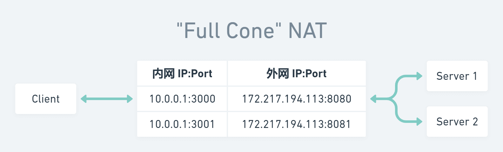
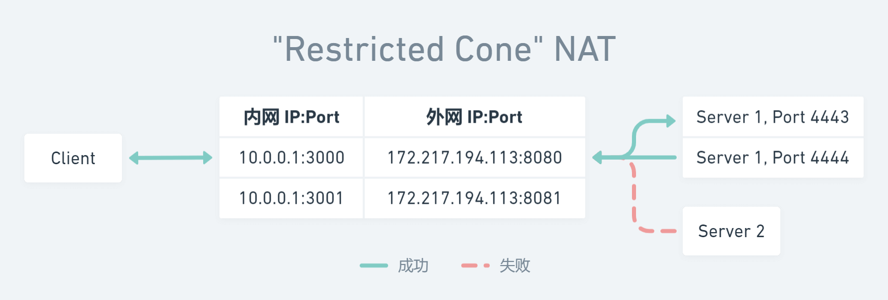
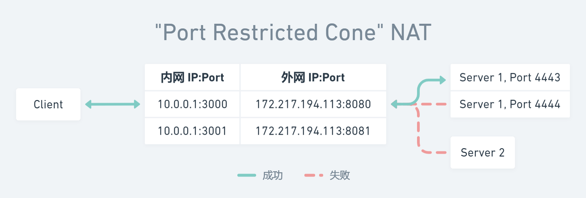
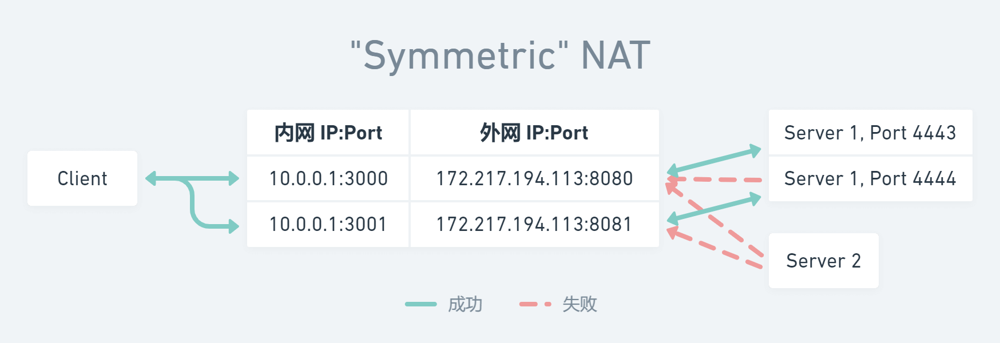
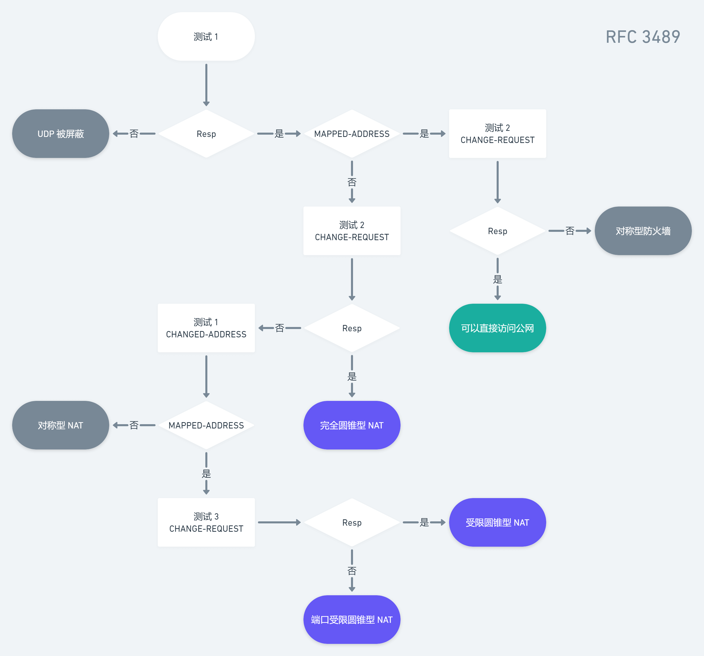

在 [上篇文章](../p2p-hole-punching/) 中，我们大致了解了 P2P 的打洞原理。但实际情况比理论要复杂得多。**经典的** NAT（NAPT）可分为完全圆锥型、受限圆锥型、端口受限圆锥型和对称型四种，需要借助 ICE（Interactive Connectivity Establishment，交互式连接建立）框架辅助连接。

之所以强调是经典的，是因为这四种类型最早由 [RFC 3489](https://tools.ietf.org/html/rfc3489) 定义；但后来的实践证明市场上的 NAT 实现远不止这四种类，于是便在 [RFC 5389](https://tools.ietf.org/html/rfc5389) 中做了修正。不过这并不妨碍我们简单理解 ICE 的交互过程。本文依然以经典的 NAT 类型为主；对于两份 RFC 的不同之处，感兴趣的读者可以参考这个链接 [STUN (RFC 3489) vs. STUN (RFC 5389/5780)](https://netmanias.com/en/post/techdocs/6065/nat-network-protocol/stun-rfc-3489-vs-stun-rfc-5389-5780)。

## 完全圆锥型

完全圆锥型满足：一旦内部地址 `iAddr:iPort` 映射到外部地址 `eAddr:ePort` ，所有发自 `iAddr:iPort` 的数据包都经由 `eAddr:ePort` 向外发送；且任意外部主机发送的数据包都能经由 `eAddr:ePort` 到达 `iAddr:iPort` 。

## 受限圆锥型

受限圆锥型满足：一旦内部地址 `iAddr:iPort` 映射到外部地址 `eAddr:ePort` ，所有发自 `iAddr:iPort` 的数据包都经由 `eAddr:ePort` 向外发送；但只有曾经接收到 `iAddr:iPort` 发送的数据包的外部主机 `nAddr:any` 发送的数据包，才能经由 `eAddr:ePort` 到达 `iAddr:iPort` 。注意，这里的 `any` 指外部主机源端口不受限制。即受限圆锥型限制了可以发送数据包的外部主机的 IP，但没有限制外部主机的端口号。

## 端口受限圆锥型

端口受限圆锥型在受限圆锥型的基础上，加上了对外部主机的端口号限制，即只有曾经接收到 `iAddr:iPort` 发送的数据包的外部主机 `nAddr:nPort` 发送的数据包，才能经由 `eAddr:ePort` 到达 `iAddr:iPort` 。

## 对称型

对称型的场景比较复杂一些。我们将内部地址 `iAddr:iPort` 与外部主机 `nAddr:nPort` 的地址和端口号组成一个四元组 `(iAddr, iPort, nAddr, nPort)` ，对于四元组中的不同取值，NAT 都会对应分配一个外部地址 `eAddr:ePort` ；并且也只有曾经收到内部主机数据的对应的外部主机，才能够把数据包发回。

## ICE

从上述描述可以看出，外部主机和位于 NAT 之后的设备进行通信的难度是逐步提升的，即「完全圆锥型 < 受限圆锥型 < 端口受限圆锥型 < 对称型」。

对于圆锥型，我们依然可以使用 [上篇文章](../p2p-hole-punching/) 中介绍的通过公网服务器做地址转发的方式打洞连接。但对于对称型，只能使用公网服务器做流量中继的方式进行连接，因为对于四元组中的不同取值，NAT 都会对应分配一个外部地址 `eAddr:ePort` ；所以对称型与公网服务器进行连接并被交换的外部地址，并不是对端能连接成功的外部地址。

所以正如本文开头提到的那样，对于不同的 NAT 类型，我们需要借助 ICE（Interactive Connectivity Establishment，交互式连接建立）框架使用不同的方式进行打洞，这个框架能让两端能够互相找到对方并建立连接。大致流程如下：

1. TCP 直接连接时，通过 HTTP 端口或 HTTPS 端口。
2. UDP 直连时，使用 STUN（Session Traversal Utilities for NAT）服务器做地址转发。
3. 间接连接均使用 TURN（Traversal Using Relays around NAT）服务器做流量中继。

当然，NAT 自己不会告诉服务器它是什么类型的，我们需要一套交互式策略检测对应的类型，而检测工作一般是由 STUN 服务器完成的。

## STUN

STUN（Session Traversal Utilities for NAT，NAT 会话穿越应用程序）是一种允许位于 NAT 之后的客户端找出自己的公网地址，并判断出 NAT 限制其直连的方法的协议。

下图是 [RFC 3489](https://datatracker.ietf.org/doc/html/rfc3489#section-10.1) 中给出的 STUN 工作流程。其中不可避免地涉及到了 STUN 协议的一些细节，但其实读者不需要对 STUN 协议特别了解也能大致理解该流程。

在测试 1 中，客户端发送的 STUN Binding Req 既不需要设置 `CHANGE-REQUEST` 属性中的任何标志位，也不需要设置 `RESPONSE-ADDRESS` 属性；服务器会向 Req 对应的地址和端口号发送 Binding Resp。如果客户端没有收到 Resp，则说明所在网络禁用了 UDP；如果客户端收到了 Resp，则会检查 Resp 的 `MAPPED-ADDRESS` 属性，如果其中的地址和端口号与 Req 对应的地址和端口号相同，则说明此时客户端至少不在 NAT 之后。然后进行测试 2。

在测试 2 中，客户端发送的 STUN Binding Req 需要同时设置 `CHANGE-REQUEST` 属性中的「改变 IP」和「改变端口号」标志位。如果客户端没有收到 Resp，则说明此时客户端位于对称型 UDP 防火墙之后（一种类似对称型 NAT 的防火墙）；如果客户端收到了 Resp，则说明此时客户端可以直接访问公网（或者，至少位于一个类似完全圆锥型 NAT 的防火墙之后）。这里防火墙与 NAT 的区别是，防火墙没有地址转换（translation）。

回到测试 1，如果客户端发现 Resp 的 `MAPPED-ADDRESS` 属性中的地址和端口号与 Req 对应的地址和端口号不同，则说明此时客户端位于 NAT 之后。然后进行测试 2，如果客户端收到了 Resp，则说明此时客户端位于完全圆锥型 NAT 之后；如果客户端没有收到 Resp，则再次进行测试 1，只不过这次客户端发送的目标地址和端口号取自之前测试 1 的 Resp 的 `CHANGED-ADDRESS` 属性中的地址和端口号。对比前后两次测试 1 返回的 Resp 的 `MAPPED-ADDRESS` 属性中的地址和端口号，如果存在不同，则说明此时客户端位于对称型 NAT 之后；否则位于受限圆锥型 NAT 或者端口受限圆锥型 NAT 之后，为了搞清楚具体是哪一种，我们还需要进行测试 3。

在测试 3 中，客户端发送的 STUN Binding Req 仅需要设置 `CHANGE-REQUEST` 属性中的「改变端口号」标志位。如果客户端没有收到 Resp，则说明此时客户端位于端口受限圆锥型 NAT 之后；如果客户端收到了 Resp，则说明此时客户端位于受限圆锥型 NAT 之后。

当然啦，如果客户端和服务器之间有多个 NAT，则上述 STUN 流程将会推断出整个链路中限制最严格的那个 NAT 类型。客户端也需要定期重试，检查网络状态是否发生了变化。

## TURN

由于对称型 NAT（或防火墙）无法被穿越，我们需要一种名为 TURN（Traversal Using Relays around NAT，NAT 中继遍历程序）的服务器来转发流量。

位于对称型 NAT 之后的客户端需要先在 TURN 服务器上创建连接，然后告诉所有对端设备发包到这个服务器上，然后服务器再把包转发给这个客户端。并且 TURN 服务器通常是和 STUN 服务器成对出现的，当 STUN 判断 NAT 为对称型时，就会交由 TURN 处理。

---

以上就是对 ICE、STUN、TURN 的介绍了。实际的 ICE 过程要比本文介绍的复杂得多，感兴趣的读者可以自行阅读 [RFC 5245](https://tools.ietf.org/html/rfc5245)。当然，我们也没有必要自己实现一套 ICE 框架，常用的第三方 RTC 框架比如 [mediasoup](https://github.com/versatica/mediasoup) 均已实现了 ICE，直接使用即可。
