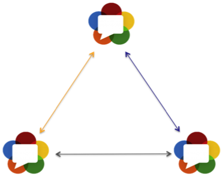
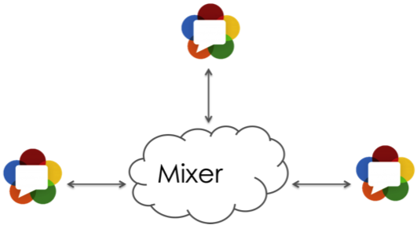
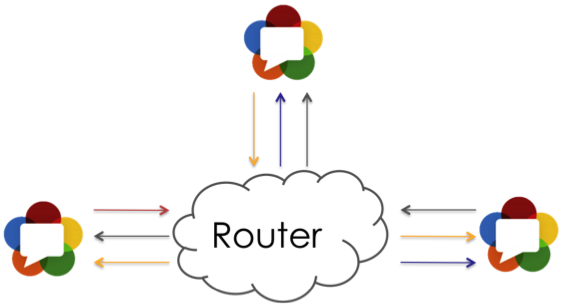

*本文译自博客 [WebRTC beyond one-to-one communication](https://webrtchacks.com/webrtc-beyond-one-one)。建议读者结合原文观看。*

WebRTC 及其点对点（Peer-to-Peer）的能力，使之非常适合一对一通信。但是当我和客户聊到一对一之外的场景，比如一对多、多对多，一个常见的问题便是该使用怎样的架构去实现。一些服务商希望复用他们网络中的 Multicast（多播）能力（对此我们做了一些有趣的实验），另一些则考虑使用基于 Simulcast（同步广播）的方式，还有一些考虑使用类似 MCU 混流的中心化处理方式，当然大多数人只是简单地希望能使用 Mesh（网络拓扑）的方式。

TokBox（一家西班牙电信公司）在多人视频会议解决方案上有着非常丰富的经验。能邀请到我的好友 Gustavo Garcia Bernardo（TokBox 的云架构师）分享这个主题真是太棒了。

Gustavo 在 TokBox 负责云组件的架构设计和开发，其中便包括为 [OpenBox](https://github.com/opentok) 设计的可扩展的云架构 Mantis（OpenBox 基于 WebRTC 实现）。在加入 TokBox 之前，Gustavo 在西班牙电信（Telefónica）花费了超过 10 年的时间开发 VoIP 产品，并且推动了 WebRTC 早期在电信产品中的应用。事实上，从我第一次在欧盟委员会资助的 [P2PSIP](https://tools.ietf.org/html/rfc7890) 研究项目见到他开始，到现在我已经认识他超过 8 年了。从那以后，我们便在 IETF（互联网工程任务组）的 P2PSIP、[ALTO](https://tools.ietf.org/html/draft-ietf-alto-server-discovery-10#appendix-A) 以及 SIP（Session Initiation Protocol）相关的工作中合作。几年前，当我还在为 Acme Packet 公司（现在是 Oracle 公司）工作的时候，我们一起设计并上线了 [西班牙电信的 TuMe 和 TuGo 服务](https://www.lightreading.com/telefand-243nica-tu-me-has-got-to-go/a/d-id/703670)。之后我们便将注意力转向了 WebRTC。

—— Victor Pascual Ávila

---

WebRTC 除了一对一通信外，最常见的使用场景便是多人视频会议。不要只考虑传统的会议室场景，有很多场景都超出了会议室的范畴，比如网上学习、客服支持、或者实时广播。在每个场景中，最重要的能力便是如何分发多路音视频流。所以假设你是服务供应商，你该如何将多人会议场景适配到 WebRTC 客户端上呢？

其实根据不同的需求，存在几种架构；这些架构基本都围绕两个维度展开，即中心化 vs 点对点连接（P2P）；混流 vs 路由中继。我会在这里介绍几种最流行的架构。如果你想要详细了解具体的协议和实现，可以在 [这个文档](https://tools.ietf.org/html/draft-ietf-avtcore-rtp-topologies-update-10) 中找到详细的资料。

## Mesh

Mesh 是最简单的架构。它在新的 WebRTC 服务供应商中很受欢迎，因为它（基本）不需要任何基础设施。该架构对于每个发送者和它所有可能的接收者而言，都会创建连接。

尽管这种架构看起来很低效，但实践证明它非常有效；并且由于每个接收者都具备开箱即用的带宽自适应功能，可以将延迟降至最低。

唯一的问题在于，这种架构需要大量的上行链路带宽才能同时推流给所有接收者，并且目前的浏览器实现需要消耗大量的 CPU 资源才能对视频并行编码。

## 混流

传统的多人会议架构采用的是混流模式，并且这种架构已经使用了很多年了。这是因为它需要的客户端能力最少。这种架构使用中心节点与每个参与者保持一对一连接；中心节点接收每个发送方的视频流并将它们混合成单个视频流，然后发送给每个参与者。在视频会议领域，这些中心节点被称为 [MCU（Multipoint Control Unit，多端控制器）](https://en.wikipedia.org/wiki/Multipoint_control_unit)。

混流架构的兼容性最好，可以兼容很多老旧设备；它也支持带宽自适应模式，因为混流单元可以为每个接收者分别生成不同质量的视频流。混流架构的另一个优点是它能利用硬件解码，许多 WebRTC 客户端的芯片都具有解码单个视频流的能力。

混流架构的主要问题是 MCU 的架构成本。此外，混流既需要解码还需重新编码，因此会增加延迟以及降低画质。同时混流也降低了客户端 UI 的灵活性（尽管存在一些解决方案）。

## 路由中继

路由中继架构是 [H.264 SVC](https://en.wikipedia.org/wiki/Scalable_Video_Coding) 普及后流行起来的，并且已经被广泛应用于新的没有历史包袱的 WebRTC 平台。该架构使用中心节点接收每个发送方的视频流，并将其转发给其他参与者。中心节点对数据包仅仅进行检查和转发，而不进行解码和再编码。

路由中继提供了一种廉价的且可扩展的多人会议架构；与混流架构相比，它具有较低的延迟，并且没有画质损失。

但另一方面，大部分从业者往往缺乏搭建这种架构的经验，并且对于不同的接收方适配起来较为棘手。这需要发送方支持生成一个流的多个版本（比如 Simulcast 或者 [VP8](https://trac.ietf.org/trac/payload/ticket/1)），路由器会根据接收方的客户端能力选择性地转发对应的流。

## 我该使用哪种架构？

不幸的是，这并不是一个简单的问题。一些服务供应商为了满足不同客户的需求，提供了上述所有架构的支持。不过这里还是有一些通用的选择方式以供参考。

如果你提供的是纯音频服务，或者需要兼容老旧设备，那么混流架构是不错的选择。此外，假如你的成本开销并不是问题；并且参与者们各自的连接性非常不同，也可以使用混流。

如果你的服务的使用者们有着非常好的网络，他们的设备配置也很给力（比如公司内部服务），并且参与者数量有限，那么 Mesh 架构是不错的选择。

如果你要部署大规模服务，那么就选择路由中继架构。总的来说，路由中继架构既能较好地利用客户端算力，同时还能保持良好的扩展性和灵活性。

## WebRTC 缺少了什么？

尽管存在各种免费或者付费的 WebRTC 多人会议解决方案，但是仍然存在一些可以提升用户体验的技术设施建设，包括但不限于如下几点：

1. 提升音频处理和编码的效率，尤其是提升回声消除和噪声抑制算法。
2. 更高级、更灵活的拥塞控制，可以即时修改流的参数，例如比特率、视频质量或分辨率。
3. [支持 Simulcast 和 Layered Video Coding](https://tools.ietf.org/html/draft-garcia-simulcast-and-layered-video-webrtc-00)，以使原始视频流能分别适配每个接收方的客户端能力。对于 Simulcast 而言，存在一些解决方案；但对于 VP8 的 Layered Video Coding，恐怕我们就得去修改 WebRTC 的代码了（不知道 2021 年的今天还需要这样不 🤔

总而言之，基于 WebRTC 开发多人会议服务是一个好的开始。随着 [W3C 标准](https://www.w3.org/TR/webrtc/) 的发展、更多的 API，以及各大浏览器厂商的跟进，基于 Web 的视频会议将拥有光明的未来！

—— Gustavo Garcia Bernardo
