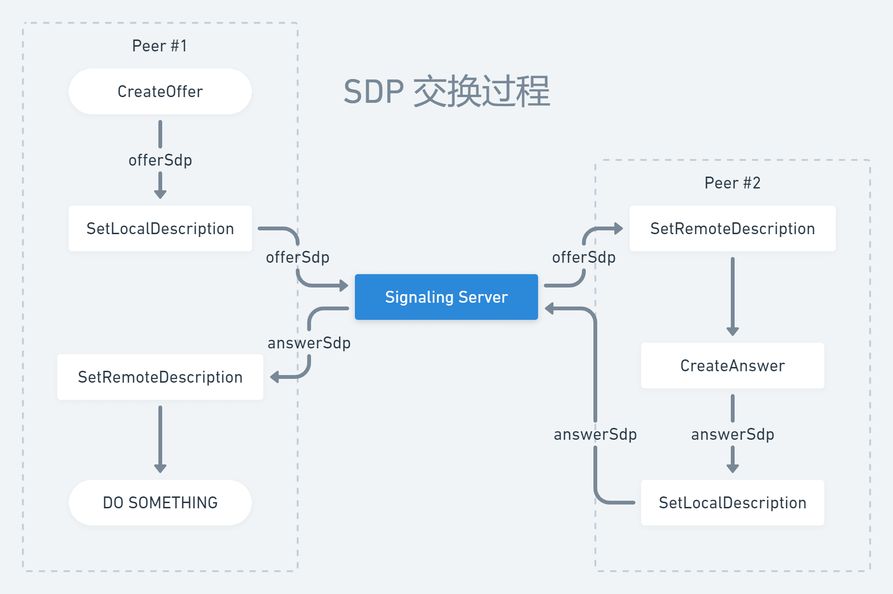

SDP 全称 Session Description Protocol，即会话描述协议。SDP 是一份具有特殊约定格式的纯文本描述文档（类似 JSON / XML），其中包含了 WebRTC 建立连接所需的 ICE 服务器信息、音视频编码信息等，而开发者可以使用 WebSocket 等传输协议将其发送到信令服务器。

## 格式和字段

SDP 遵循 `<type>=<value>` 这样的格式，其中 `<type>` 和 `<value>` 均大小写敏感，且 `=` 之间不能有空格。SDP 由会话级别（session-level）的描述和其后零个或多个媒体级别（media-level）的描述组成。会话级别从 `v=` 开始，并且持续到第一行媒体级别 `m=` 所在的位置。每个媒体级别的描述均以 `m=` 开始，并且持续到下一个 `m=` 开始的位置，或者 SDP 末尾。

SDP 中有的字段是必须的（REQUIRED）；有的字段是可选的（OPTIONAL），可选的字段在如下示例中使用 `*` 标记。所有字段必须遵循如下顺序排列，这样既可以增强错误检测能力，并且解析器（parser）实现起来也简单很多：

```
# 1. 会话级别的描述（及其字段）
v=  (protocol version)
o=  (originator and session identifier)
s=  (session name)
i=* (session information)
u=* (URI of description)
e=* (email address)
p=* (phone number)
c=* (connection information -- not required if included in all media)
b=* (zero or more bandwidth information lines)
# 2. 一个或多个时间描述（字段参见下文）
z=* (time zone adjustments)
k=* (encryption key)
a=* (zero or more session attribute lines)
# 3. 零个或多个媒体级别的描述（字段参见下文）

# 时间描述的字段有这些
t=  (time the session is active)
r=* (zero or more repeat times)

# 媒体级别的描述字段有这些
m=  (media name and transport address)
i=* (media title)
c=* (connection information -- optional if included at session level)
b=* (zero or more bandwidth information lines)
k=* (encryption key)
a=* (zero or more media attribute lines)
```

可以看到，SDP 的字段名 `<type>` 故意设计得十分简短，因为其本意便是不可随意扩展的，解析器遇到不可识别的字段名可以直接忽略之。如果想要针对特定类型的媒体或应用做扩展，可以使用专为扩展而设计的 `a` 字段。

会话级别的描述中的 `c` 和 `a` 的值默认适用于所有媒体级别的描述。不过如果某个媒体级别的描述具有相同名称的字段，则可复写之（类似父类和子类的复写）。

以下是一个典型的 SDP 描述，大家可以有一个感性的认识：

```
v=0
o=jdoe 2890844526 2890842807 IN IP4 10.47.16.5
s=SDP Seminar
i=A Seminar on the session description protocol
u=http://www.example.com/seminars/sdp.pdf
e=j.doe@example.com (Jane Doe)
c=IN IP4 224.2.17.12/127
t=2873397496 2873404696
a=recvonly
m=audio 49170 RTP/AVP 0
m=video 51372 RTP/AVP 99
a=rtpmap:99 h263-1998/90000
```

关于 SDP 格式和字段的更多内容，本文就不继续展开了，建议读者直接查阅 [RFC 4566 - SDP: Session Description Protocol](https://tools.ietf.org/html/rfc4566)。SDP 通常是 WebRTC 根据代码配置生成的，开发者不需要刻意去手动修改 SDP。并且我们通常接触的 SDP 字段可能就那几个，笔者会在后续文章中提及。

## 信令服务器

WebRTC 设备之间建立连接先需要获得彼此的 SDP。而设备是无穷无尽的，我们不可能凭空知道任意设备的 SDP，因此需要借助一台第三方服务器交换彼此的 SDP，而这台服务器我们便称之为信令（Signaling）服务器。

通常来说，我们使用 WebSocket 与信令服务器之间进行连接。由于 WebSocket 是双向通信协议，服务器可以很轻易地发送数据给客户端。而「信令」这个词虽然听起来有点拗口，但其实就是一系列 WebSocket 请求，开发者可以自定义 RequestBody 的内容（比如使用 JSON），只要能表达自己想表达的意思就好。

信令服务器除了被用来交换 SDP，还会被用来维护进房逻辑、传递用户的状态（比如开关摄像头）等。饶是如此，信令服务器并不是 WebRTC 的一部分，你可以使用自己喜欢的 Web 后端框架实现它，比如 [Django](https://github.com/django/django)、[Gin](https://github.com/gin-gonic/gin) 或者 [Koa](https://github.com/koajs/koa)。

此外，在 [ICE 交互流程介绍](../ice-stun-turn/) 中我们提到，WebRTC 需要借助 ICE 服务器进行 P2P 打洞连接。那么这里的 ICE 服务器可以和信令服务器是同一个服务，也可以是分别独立的服务。独立的服务可能有利于后端横向扩容，不过这超出了本文的讨论范围。笔者在实际项目中使用的 WebRTC 框架是 [mediasoup](https://mediasoup.org/)，它同时集成了 ICE 和信令两个功能，即同一个服务（简单）。

## 交换过程

WebRTC 使用 [PeerConnection](https://webrtc.googlesource.com/src/+/refs/heads/master/pc/peer_connection.h) 这个类创建连接，它包含两个生成 SDP 的方法，分别是 `CreateOffer()` 和 `CreateAnswer()`，前者由会话发起方调用生成 offerSdp 并发送到信令服务器；后者在应答方在收到信令服务器消息后被调用生成 answerSdp，然后也发送回信令服务器。

PeerConnection 还包含两个设置 SDP 的方法，分别是 `SetLocalDescription()` 和 `SetRemoteDescription()`，前者用来设置本地（自己）的 localSdp，后者用来设置接收到的对端 remoteSdp。对于会话发起方而言，localSdp 即是 offerSdp，remoteSdp 即是 answerSdp；对于应答方而言，localSdp 即是 answerSdp，而 remoteSdp 即是接收到的 offerSdp。

上述四个方法的有序组合即可构成 WebRTC 设备之间的 SDP 交换过程。其实这也是一种协商过程，因为应答方需要根据发起方提供的 SDP（ICE 服务器信息、音视频编码信息等）决定如何回复。因为与后续的「连接流程」章节的内容有重合，这里只是简单地给出示意图：



以上。相信读者已经对 SDP 及其交换过程有了比较清晰的了解。
