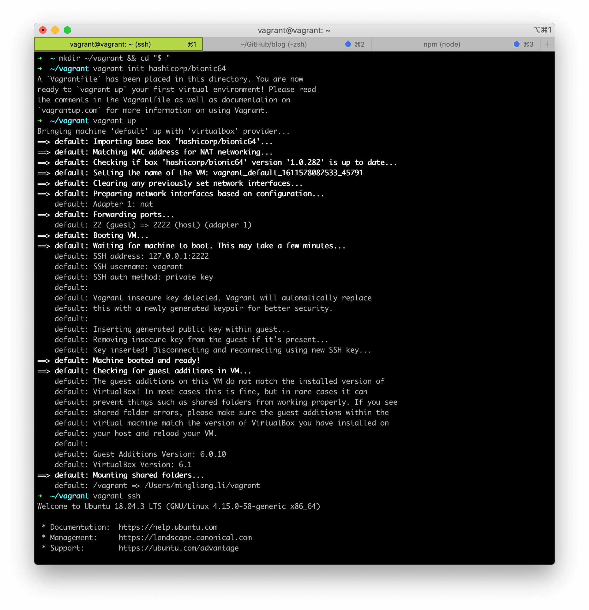
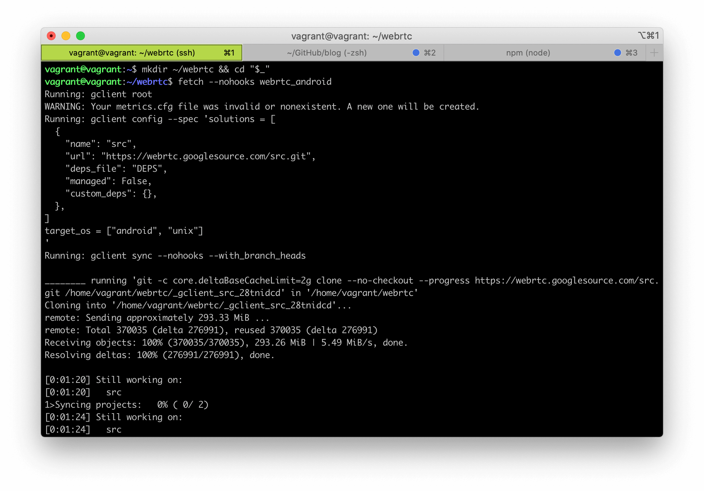
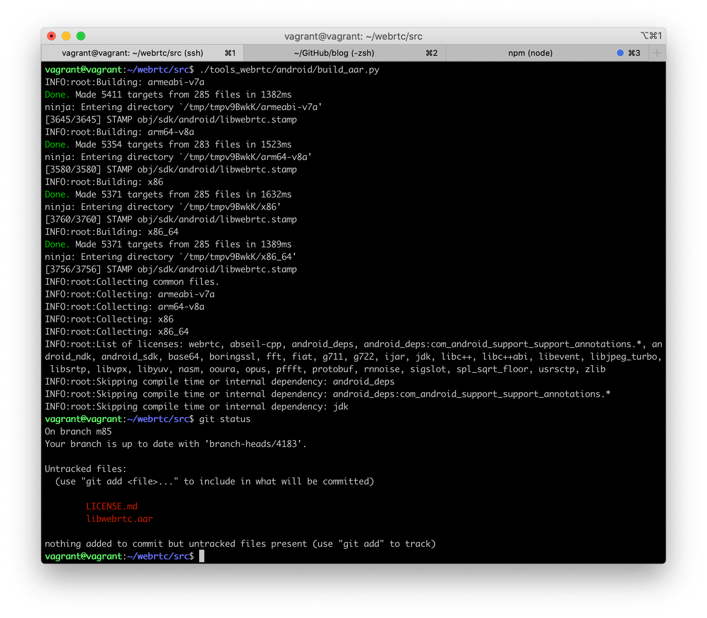

在正式开始之前，我们需要一个可以运行的 WebRTC 环境。由于笔者是 Android 开发，因此本文将根据 [官方文档](https://webrtc.googlesource.com/src/+/refs/heads/master/docs/native-code/android/index.md) 将 WebRTC 编译到 Android（iOS 的编译方法则可以参见 [这个链接](https://webrtc.googlesource.com/src/+/refs/heads/master/docs/native-code/ios/index.md)）。

## 搭建环境

编译到 Android 必须使用 Linux 开发环境；对于 Windows 而言，可以使用 [WSL](https://docs.microsoft.com/zh-cn/windows/wsl/) 作为开发环境。笔者使用的是 macOS，尽管与 Linux 同为类 Unix 系统，但也是不能直接编译到 Android 的。不过没关系，我们可以借助 [vagrant](https://learn.hashicorp.com/tutorials/vagrant/getting-started-index?in=vagrant/getting-started) 很方便地搭建起 Linux 开发环境。

首先我们需要下载并安装 [VirtualBox](https://www.virtualbox.org/)；接着执行 `brew install vagrant` 安装 vagrant（基于 VirtualBox 搭建开发环境）。然后执行如下命令：

```bash
# 创建并切换到 ~/vagrant 目录
$ mkdir ~/vagrant && cd "$_"
# 初始化虚拟机（目前系统为 Ubuntu 18.04 LTS 64-bit）
$ vagrant init hashicorp/bionic64
# 启动这个虚拟机
$ vagrant up
# 通过 ssh 连接到这个虚拟机
$ vagrant ssh
```



**接下来所有操作都将在虚拟机中进行。**如果你想登出虚拟机，输入 logout 即可。

## 获取源码

首先我们需要将 [depot_tools](https://commondatastorage.googleapis.com/chrome-infra-docs/flat/depot_tools/docs/html/depot_tools_tutorial.html#_setting_up) clone 到本地。我们都知道 WebRTC 是 Chromium 项目的一部分，而 depot_tools 便是为了组织和管理 Chromium 这个庞大代码库而设计的 Git 工作流增强工具集合。执行如下命令即可：

```bash
$ git clone https://chromium.googlesource.com/chromium/tools/depot_tools.git
```

接着将如下命令加入到 `~/.bashrc` 中，并输入 `source ~/.bashrc` 重载 bash。其中的 `/path/to/` 需要你替换为 depot_tools 的所在路径：

```bash
export PATH=/path/to/depot_tools:$PATH
```

然后执行如下命令，整个过程需要大约 40 分钟，请保持耐心 🙏

```bash
#添加完depot_tools到PATH之后，需要在任意目录下运行 gclient ，它会自动update depot_tools一些组件，如果直接运行fetch命令，可能会缺乏一些组件报错
$ gclient
# 创建并切换到 ~/webrtc（也可以是自定义路径）
$ mkdir ~/webrtc && cd "$_"
# 拉取并同步 WebRTC 的最新代码
$ fetch --nohooks webrtc_android
$ gclient sync
```



下载的代码包含正常的 WebRTC 分支和 Android 分支；Android 分支包含 SDK 和 NDK。这份代码既可以被用来进行 Android 开发，也可以被用来进行正常的 Linux 开发。因为 WebRTC 使用 [Ninja](https://ninja-build.org/) 作为其构建系统，你只需要在不同路径下生成不同的编译配置即可。

相信你已经执行完上述所有流程了。此时你应该位于 WebRTC 的 master 分支，但我们一般不直接使用 master，而是应该切换到最近一个 release 版本，[可以在这里获取到所有 release 信息](https://chromiumdash.appspot.com/branches)。本文选取的 release 版本为 M85 (branch-heads/4183)。

```bash
# 下载的代码位于 ~/webrtc/src
$ cd ~/webrtc/src
# 创建一个新的分支 m85（注意一定要 sync）
$ git checkout -b m85 branch-heads/4183
$ gclient sync
```

**接下来所有操作都将在 ` ~/webrtc/src` 目录中进行。**你可以按照如下步骤更新到最新代码：

```bash
# 切换到 master 分支
$ git checkout master
$ git pull origin master
$ gclient sync
# 切换回你自己的分支（有冲突的话自己解决）
$ git checkout my-branch
$ git merge master
```

## 编译源码

执行如下命令，安装 WebRTC 所需的依赖然后编译。需要大约 60 分钟，请保持耐心 🙏

```bash
# 安装编译 WebRTC 所需的依赖
$ ./build/install-build-deps.sh
$ ./build/install-build-deps-android.sh
# -h 可以查看有哪些编译参数
$ ./tools_webrtc/android/build_aar.py -h
# 直接执行脚本，使用默认参数进行编译
$ ./tools_webrtc/android/build_aar.py
```



如图，编译结果 libwebrtc.aar 默认位于 `~/webrtc/src` 目录下，包含了 armeabi-v7a、arm64-v8a、x86 和 x86_64 四种架构的 .so（可以通过 -h 查看如何只编译指定架构的包）。

## Demo

执行 `cp libwebrtc.aar /vagrant` 将 libwebrtc.aar 拷贝到 `/vagrant` 目录，这个目录是虚拟机与宿主机（macOS）的共享文件目录。对于本文而言，宿主机（macOS）对应的目录为 `~/vagrant` ，即我们一开始搭建环境的目录。

WebRTC 官方提供了一个名为 AppRTC 的 demo，但将它导入 Android Studio 的过程非常繁琐，且依赖复杂。这里笔者提供了一个整理后的版本 [mthli/YaaRTC](https://github.com/mthli/YaaRTC)，读者可以自行将其中的 `app/libs/libwebrtc.aar` 替换为自己编译出来的 libwebrtc.aar 进行测试。

读者可以在浏览器端访问 [https://appr.tc](https://appr.tc)，然后在 YaaRTC 里输入相同的房间号并加入之。只要能双向视频成功，就说明我们编译出来的 libwebrtc.aar 是没问题的啦 🍻

---

**目前 [https://appr.tc](https://appr.tc) 已被 Google 停用，有能力的读者可以自行搭建 [webrtc/apprtc](https://github.com/webrtc/apprtc) 服务。**
