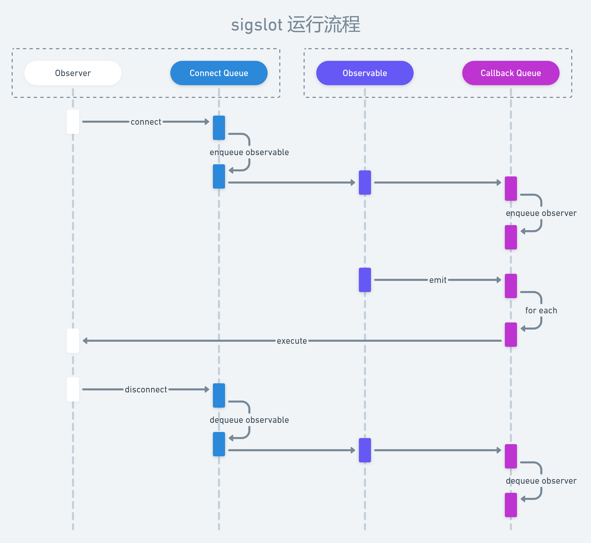

在阅读 WebRTC 源码过程中，经常可以看到 [sigslot](http://sigslot.sourceforge.net/)（信号槽）相关的代码调用，例如：

```cpp:title=peer_connection.cc
// PeerConnection 继承自 sigslot::has_slots
bool PeerConnection::Initialize(/* args... */) {
  // method body...

  // std::unique_ptr<JsepTransportController> transport_controller_;
  transport_controller_.reset(new JsepTransportController(/* args... */));
  // 调用 connect 时需要传入两个参数，即接收回调的对象的指针，和回调方法的指针
  transport_controller_->SignalIceConnectionState.connect(
    this, &PeerConnection::OnTransportControllerConnectionState);

  // method body...
}
```

而 `JsepTransportController::SignalIceConnectionState` 的定义如下：

```cpp:title=jesp_transport_controller.h
class JsepTransportController : /* extends... */ {
 public:
  // other defines...

  // sigslot::signal 支持操作符重载，
  // void operator()(Args... args) { emit(args...); }
  sigslot::signal1<cricket::IceConnectionState> SignalIceConnectionState;

  // other defines...
}
```

当 JsepTransportController 调用 `SignalIceConnectionState(state)` 时，便会回调 `PeerConnection::OnTransportControllerConnectionState` 这个方法；事实上只要 connect 了的方法，都会被回调。对于 Java(Script) 开发者来说，这种回调机制肯定不陌生，其实就是一种观察者模式的实现，**主要是为了代码解耦。**

## 资源管理

当上述 PeerConnection 不再需要响应 SignalIceConnectionState 时，便可以手动调用 `transport_controller_->SignalIceConnectionState.disconnect(this)` 取消回调。如果需要取消的类似回调较多，难免会出现遗漏的情况，此时便有可能造成内存泄漏。

WebRTC 使用的 [sigslot](http://sigslot.sourceforge.net/) 实现要求接收回调的 class **必须**继承自 `sigslot::has_slots`（C++ 支持多继承），这个类在析构时，会自动调用 disconnect 取消所有子类已经注册了的回调，从而有效避免了内存泄漏（甚至是野指针崩溃）。

听起来有些神奇，父类怎么知道子类注册了哪些回调？这就不得不说 sigslot 的实现技巧了。`sigslot::has_slots` 内部维护了一个用于存储观察对象（Observable）的队列，当子类调用 connect 时，观察对象便会入队；当析构时，将各个观察对象出队并执行 disconnect。这里仅给出如下运行流程图，读者可以结合源码 [sigslot.h](https://webrtc.googlesource.com/src/+/refs/heads/master/rtc_base/third_party/sigslot/sigslot.h) 进行理解：



## 线程竞争

有时候你可能会期望回调执行过程中能避免线程竞争问题，比如避免同一个观察对象的多种回调交叉（乱序）执行。WebRTC 使用的 [sigslot](http://sigslot.sourceforge.net/) 实现提供了一种简单的解决方案，即在回调产生时，先尝试获取锁，只有获得锁的回调才能执行：

```cpp:title=sigslot.h
template <class mt_policy, typename... Args>
class signal_with_thread_policy : public _signal_base<mt_policy> {
  // other defines...

  void emit(Args... args) {
    // highlight-next-line
    lock_block<mt_policy> lock(this);
    // method body...
  }

  // other defines...
};
```

熟悉 C++ 的读者一眼就可以看出 `lock_block<mt_policy> lock(this);` 使用了 C++ [RAII](https://zh.cppreference.com/w/cpp/language/raii) 机制创造出了一段函数生命周期内的临界区。不熟悉的读者可以参见 [临界锁实现](../criticalsection)。

这里的 `mt_policy` 可以指定锁的类型，比如全局锁或对象锁，当然也可以选择不加锁（即 `lock_block` 内部为空实现）。其实在 WebRTC 99% 的代码中使用的都是不加锁模式，因为其内部维护着良好的线程模型，回调会被切换到对应类型的线程上执行，基本不存在线程竞争问题。关于 WebRTC 的线程模型笔者将会在后续文章中进行讲解。
