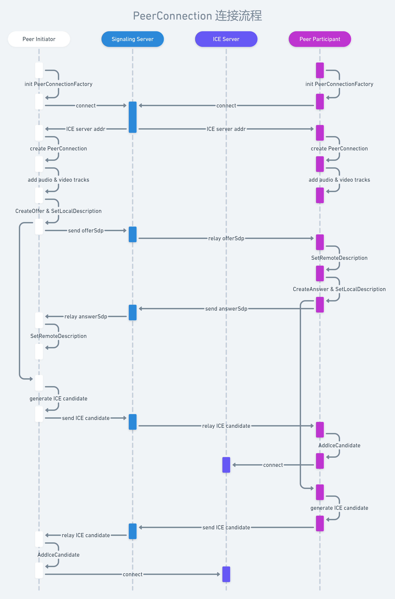

[PeerConnection](https://webrtc.googlesource.com/src/+/refs/heads/master/pc/peer_connection.h) 是 WebRTC 连接流程中无法绕过的一个类，甚至可以认为这个类是整个连接流程的 Controller。本文着重介绍双人通话（一对一）的连接流程，读者可以很轻易地将其推演至多人通话（一对多、多对多）的场景。建议结合 [mthli/YaaRTC](https://github.com/mthli/YaaRTC) 的源码学习。

假定读者已经阅读过「基础知识」中的内容，对信令（signaling）服务器、ICE 服务器等概念都有所了解，那么没有什么比一张时序图更加简洁清晰的了：

这里针对时序图中的一些情况做具体说明：

1. 上图不完全是 API 的调用流程，读者在编程时仍需参考 WebRTC 的文档或源码注释。
2. 先进入房间的用户是发起方（Indicator），后进入房间的用户是参与者（Participant）。如果参与者进房时信令服务器已经有 offerSdp 甚至（发起方的）ICE candidate 信息了，则信令服务器可以将它们与 ICE server addr 一起返回给参与者。
3. add audio & video tracks 不是连接流程中的关键步骤，也可以在 ICE 流程之后再执行。
5. 在 SetLocalDescription 执行成功后，协商 SDP 和 ICE candidate 的流程便会同时开始。
6. 通话双方均与选定的 ICE 服务器连接成功后，即可开始相互推流。
7. 在 [多人会议服务端架构](../../basic/mesh-mcu-sfu/) 中，一般由 SFU 服务器同时充当 ICE 服务器的角色。
