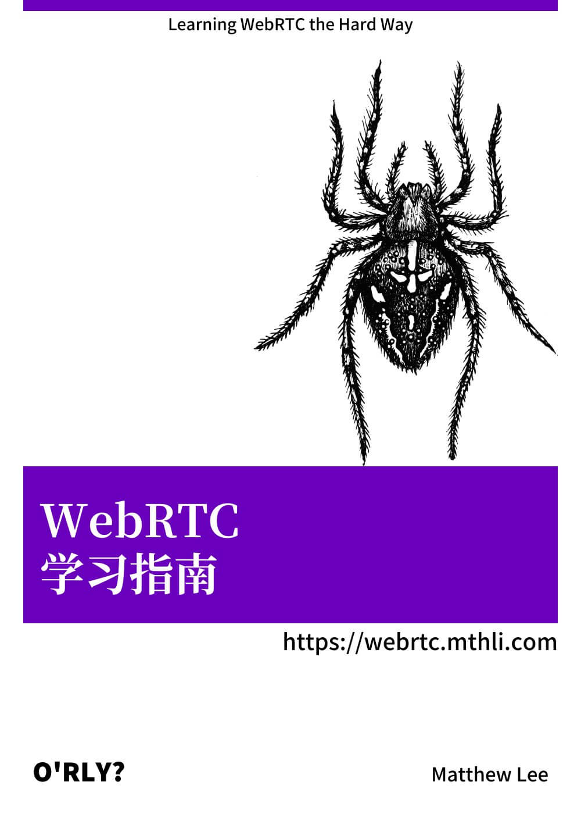

几个月以前笔者换了工作，从北京到了深圳。工作内容从原本的 Android 业务开发转向了基于 WebRTC 的直播 SDK 开发。在工作过程中，笔者发现互联网上关于 WebRTC 的资料并不充足也不系统，分散在各个角落，于是便萌生了自己写一份学习资料的想法。

如今笔者参与封装的 SDK 0.1 版本已经上线，笔者也对 WebRTC 的整体架构有了大致的了解，相信能为从事（直播）音视频开发的同学提供一份**持续更新**的参考资料。

如果读者对相关内容有异议或者疑惑，可以在文档的最下面评论（需要登录 GitHub），或者通过文档右侧的「在 GitHub 编辑」按钮 fork 本项目并发起 PR。以上。
