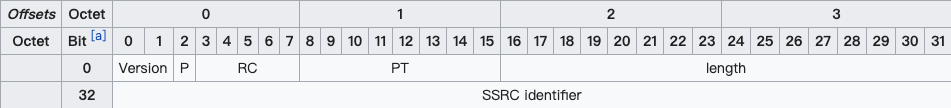
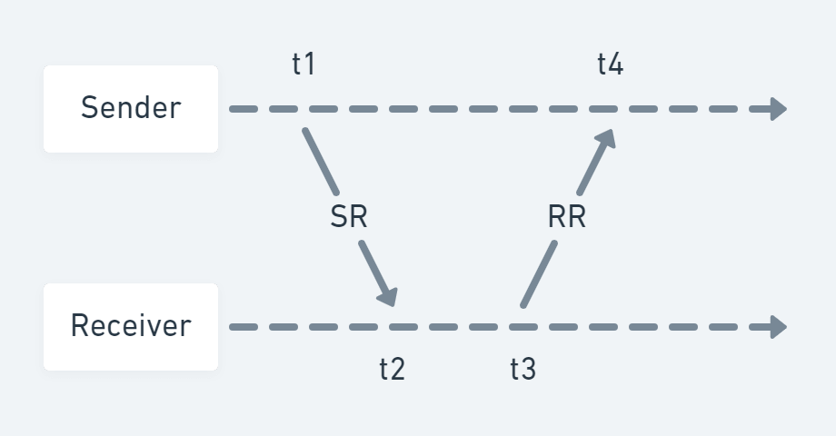

WebRTC 使用 RTP 协议传输音视频，也依赖于 RTP 协议提供的信息处理丢包。本文尝试结合 [RFC 3350](https://tools.ietf.org/html/rfc3550) 对 RTP 协议做一个较为简洁的介绍，方便大家查阅。

RTP（Real-time Transport Protocol，实时传输协议）是一种运行在 OSI 应用层的协议，通常基于 UDP 协议，但也支持 TCP 协议。它提供了端到端的实时传输数据的功能，但不包含资源预留存 [^1]（resource reservation）、不保证实时传输质量，这些功能都需要 WebRTC 自己实现。

RTP 协议分为两种子协议，分别是 RTP Data Transfer Protocol 和 RTP Control Protocol。前者顾名思义，是用来传输实时数据的；后者则是我们常说的 RTCP 协议，可以提供实时传输过程中的统计信息（如网络延迟、丢包率等），WebRTC 正是根据这些信息处理丢包。

## RTP Data Transfer Protocol

由于是 OSI 应用层的协议，我们直接来看包结构就好。RT(D)P 包分为两部分，分别是 header 和 payload，header 包含了实时音视频的同步信息（和一些额外参数），payload 则承载了具体的音视频数据。这里我们只需要关注 header 结构就好，payload 是编解码器关心的。一个典型的 RT(D)P header 结构如下图 [^2] 所示：


如图所示，RT(D)P header 最小为 12 bytes；红色部分为可选字段。字段的含义分别如下：

- **Version** 表示 RTP 协议的版本，目前版本为 2。
- **P (Padding)** 表示 RT(D)P 包末尾是否有 padding bytes，且 padding bytes 的最后一个 byte 表示 bytes 的数量。Padding 可以被用来填充数据块，比如加密算法可能会用到。
- **X (Extension)** 表示是否有头部扩展，头部扩展可以用于存储信息，比如视频旋转角度。
- **CC (CSRC count)** 表示红色部分的 CSRC（参见下文）数量，显然最多只能有 15 个 CSRC。
- **M (Marker)** 表示当前数据是否与应用程序有某种特殊的相关性。比如传输的是一些私有数据，或者数据中的某些标志位具有特殊的作用。
- **PT (Payload type)** 表示 payload 的数据类型，音视频的默认映射格式可参见 [RFC 3551](https://tools.ietf.org/html/rfc3551#page-32)。
- **Sequence number** 是递增的序列号，用于标记每一个被发送的 RT(D)P 包。接收方可以根据序列号按顺序重新组包，以及识别是否有丢包。序列号的初始值应当是随机的（不可预测的），从而增加明文攻击的难度。
- **Timestamp** 即时间戳，接收方根据其来回放音视频。时间戳的间隔由传输的数据类型（或具体的应用场景）确定，比如音频通常以 125µs（8kHz）的时钟频率进行采样，而视频则以 90kHz 的时钟频率采样。这里时间戳的初始值也是随机选取的，是一种相对时间戳。
- **SSRC (Synchronization source)** 即同步源标识符。相同 RTP 会话中的 SSRC 是唯一的，且生成的 SSRC 也需要保持随机。尽管多个源选中同一个标识符的概率很低，但具体实现时仍然需要这种情况发生，即避免碰撞。
- **CSRC (Contributing source)** 在 MCU 混流时使用，表示混流出的新的音视频流的 SSRC 是由哪些源 SSRC 贡献的。根据上述 CC 得知，我们最多可以同时混 15 路音视频流。
- **Extension header** 即头部扩展，包含了音视频的一些额外信息，比如视频旋转角度。

### 获取视频旋转角度

这里我们简单展示一个从 RT(D)P header 中取数据的过程，即从 extension 中取出视频的旋转角度。接触过客户端摄像头开发的同学都知道，摄像头拍摄出的**原始画面**并不是我们预览时的画面，在预览时需要将原始画面旋转到**屏幕自然方向**，才是我们看到的正常画面。

每台 Android 设备（iOS 设备也类似）的相机传感器在出厂时，都会固定一个角度。假设竖屏顶部为屏幕自然方向，则前置传感器角度通常是逆时针 270°，后置摄像头角度通常是逆时针 90°；也就是说，前置摄像头记录的原始画面角度通常是逆时针 270° 的，而后置摄像头记录的原始画面角度通常是逆时针 90° 的。


于是 WebRTC 推流时有两种选择，即直接发送原始画面和旋转角度，由接收方解码时自行旋转画面；或者先旋转好画面再发送，这样接收方就不用旋转画面了。具体使用哪种推流方式取决于 SDP 协商结果，如果接收方的 SDP 中包含 `urn:3gpp:video-orientation` 字段 [^3]，即表示接收方具备旋转视频的能力，于是 WebRTC 将会使用第一种方式推流；否则使用第二种。

我们仅考虑「直接发送原始画面和旋转角度」这种方式，我们在解包时需要从 RT(D)P header 中实时读取旋转角度 [^4]，而这其实就是**位操作**。以下便是笔者在实际工作中使用的 mediasoup（SFU）读取旋转角度的代码片段 [^5]：

```cpp:title=RtpPacket.hpp
// class RtpPacket
bool ReadVideoOrientation(bool& camera, bool& flip, uint16_t& rotation) const
{
  // 从 extention header 中解析出视频旋转方向的 extenValue
  uint8_t extenLen;
  uint8_t* extenValue = GetExtension(this->videoOrientationExtensionId, extenLen);

  if (!extenValue || extenLen != 1u)
    return false;

  // 从 extenValue 对应的 bit 上获取对应的值
  uint8_t cvoByte       = Utils::Byte::Get1Byte(extenValue, 0);
  uint8_t cameraValue   = ((cvoByte & 0b00001000) >> 3);
  uint8_t flipValue     = ((cvoByte & 0b00000100) >> 2);
  uint8_t rotationValue = (cvoByte & 0b00000011);

  camera = cameraValue ? true : false;
  flip   = flipValue ? true : false;

  // 视频逆时针旋转的角度，即需要将视频顺时针旋转多少度才是屏幕自然方向
  switch (rotationValue)
  {
    case 3:
      rotation = 270;
      break;
    case 2:
      rotation = 180;
      break;
    case 1:
      rotation = 90;
      break;
    default:
      rotation = 0;
  }

  return true;
}
```

## RTP Control Protocol (RTCP)

RTCP 协议提供实时传输过程中的统计信息，如网络延迟、丢包率等。在传统的实时通讯过程中，RT(D)P 协议占用偶数位的端口，而 RTCP 协议占用随后的奇数位端口。不过如果接收方的 SDP 中包含 `rtcp-mux` 字段 [^6]，即表明接收方支持 RT(D)P 协议和 RTCP 协议共用同一个端口，即多路复用。在 Chrome 57 版本已经强制开启了 `rtcp-mux` 。

对于 RTCP 包而言，我们不只要关注 header 的结构，还要关注具体的 report block 内容。不过我们先来看一个典型的 RTCP header 结构，如下图 [^7] 所示：



RTCP header 的固定大小为 8 bytes，其中 Version、P、SSRC 的含义同上述 RTP header 相同，在此不与赘述。其他几个字段的含义分别如下：

- **RC (Reception report count)** 表示当前 RTCP 包有几个 block，显然最多只能有 32 个。
- **PT (Packet type)** 表示 RTCP 包的类型，比如 SR=200、RR=201（SR、RR 参见下文）。
- **Length** 等于整个 RTCP 包的长度**减一**（使得 Length = 0 是合法的），其值包含 header 的长度和所有 padding 占用的空间长度。值的单位是以 32 位字长（32-bit words）描述的。

### SR & RR

PT=SR=200 时，表示这个 RTCP 包记录的是**发送方**的质量数据（Sender Report）；PT=RR=201 时，表示这个 RTCP 包记录的是**接收方**的质量数据（Receiver Report）。SR 和 RR 的结构几乎一致，除了 RR 没有 sender info。先来看 SR 的结构：

```
        0                   1                   2                   3
        0 1 2 3 4 5 6 7 8 9 0 1 2 3 4 5 6 7 8 9 0 1 2 3 4 5 6 7 8 9 0 1
       +-+-+-+-+-+-+-+-+-+-+-+-+-+-+-+-+-+-+-+-+-+-+-+-+-+-+-+-+-+-+-+-+
header |V=2|P|    RC   |   PT=SR=200   |             length            |
       +-+-+-+-+-+-+-+-+-+-+-+-+-+-+-+-+-+-+-+-+-+-+-+-+-+-+-+-+-+-+-+-+
       |                         SSRC of sender                        |
       +=+=+=+=+=+=+=+=+=+=+=+=+=+=+=+=+=+=+=+=+=+=+=+=+=+=+=+=+=+=+=+=+
sender |              NTP timestamp, most significant word             |
info   +-+-+-+-+-+-+-+-+-+-+-+-+-+-+-+-+-+-+-+-+-+-+-+-+-+-+-+-+-+-+-+-+
       |             NTP timestamp, least significant word             |
       +-+-+-+-+-+-+-+-+-+-+-+-+-+-+-+-+-+-+-+-+-+-+-+-+-+-+-+-+-+-+-+-+
       |                         RTP timestamp                         |
       +-+-+-+-+-+-+-+-+-+-+-+-+-+-+-+-+-+-+-+-+-+-+-+-+-+-+-+-+-+-+-+-+
       |                     sender's packet count                     |
       +-+-+-+-+-+-+-+-+-+-+-+-+-+-+-+-+-+-+-+-+-+-+-+-+-+-+-+-+-+-+-+-+
       |                      sender's octet count                     |
       +=+=+=+=+=+=+=+=+=+=+=+=+=+=+=+=+=+=+=+=+=+=+=+=+=+=+=+=+=+=+=+=+
report |                 SSRC_1 (SSRC of first source)                 |
block  +-+-+-+-+-+-+-+-+-+-+-+-+-+-+-+-+-+-+-+-+-+-+-+-+-+-+-+-+-+-+-+-+
  1    | fraction lost |       cumulative number of packets lost       |
       +-+-+-+-+-+-+-+-+-+-+-+-+-+-+-+-+-+-+-+-+-+-+-+-+-+-+-+-+-+-+-+-+
       |           extended highest sequence number received           |
       +-+-+-+-+-+-+-+-+-+-+-+-+-+-+-+-+-+-+-+-+-+-+-+-+-+-+-+-+-+-+-+-+
       |                      interarrival jitter                      |
       +-+-+-+-+-+-+-+-+-+-+-+-+-+-+-+-+-+-+-+-+-+-+-+-+-+-+-+-+-+-+-+-+
       |                         last SR (LSR)                         |
       +-+-+-+-+-+-+-+-+-+-+-+-+-+-+-+-+-+-+-+-+-+-+-+-+-+-+-+-+-+-+-+-+
       |                   delay since last SR (DLSR)                  |
       +=+=+=+=+=+=+=+=+=+=+=+=+=+=+=+=+=+=+=+=+=+=+=+=+=+=+=+=+=+=+=+=+
report |                 SSRC_2 (SSRC of second source)                |
block  +-+-+-+-+-+-+-+-+-+-+-+-+-+-+-+-+-+-+-+-+-+-+-+-+-+-+-+-+-+-+-+-+
  2    :                               ...                             :
       +=+=+=+=+=+=+=+=+=+=+=+=+=+=+=+=+=+=+=+=+=+=+=+=+=+=+=+=+=+=+=+=+
       |                  profile-specific extensions                  |
       +-+-+-+-+-+-+-+-+-+-+-+-+-+-+-+-+-+-+-+-+-+-+-+-+-+-+-+-+-+-+-+-+
```

对于 SR 而言，sender info 结构中的字段含义分别如下：

- **NTP timestamp** 即 NTP 时间戳。完整的 NTP 时间戳为 64 位无符号定点（fixed-point）数，可以和 RR 中的时间戳计算出对应接收方的 Round-Trip Time（RTT）。
- **RTP timestamp** 对应上述 NTP 时间戳的同一时间，但是与 RT(D)P 时间戳的单位和偏移量保持一致。这种对应关系可以用于媒体源的帧间或帧内同步（如果它们的 NTP 时间戳也是同步的话），也可以被媒体无关（media-independent）的接收方用于估算 RTP 时钟频率。
- **sender's packet count** 即截止到当前 SR 生成时，发送方一共传输了多少个 RT(D)P 包。如果发送方的 SSRC 改变了，则该计数值将会被重置。
- **sender's octet count** 即截止到当前 SR 生成时，发送方一共传输了多少个 RT(D) payload 字节（并不包括 header 和 padding）。如果发送方的 SSRC 改变了，则该计数值将会被重置。这个值可以被用来估算**有效负载**的平均传输速率。

SR 和 RR 具有相同的 report block 结构，其中各个字段的含义分别如下：

1. **fraction lost** 表示最近一次 SR 或 RR 发送后，对应 SSRC 的发送方的 RT(D)P 丢包率，为 8 位定点数，换算为百分比的公式为 `percentage = fractionLost * 100 / 256` 。值等于发送方实际丢包数（参见下文）除以接收方期望收到的包数量（参见下文）。
2. **packets lost** 表示截止到当前实时通话时，对应 SSRC 的发送方的 RT(D)P 累计丢包数。值等于接收方期望收到的包数量减去实际收到的包数量，即上述「发送方实际丢包数」。
3. **extended highest sequence number received** 低 16 位为接收方从对应 SSRC 的发送方收到的最大的 RT(D)P sequence number，高 16 位为对应的 sequence number 循环次数。而对应的计算值便是上述「接收方期望收到的包数量」。
4. **interarrival jitter** 为接收方收到 RT(D)P 包的间隔时间的统计方差，为无符号整数时间值。
5. **LSR** 表示接收方收到对应 SSRC 的发送方的最近一次 SR 中的 NTP 时间戳，采用的是更加紧凑的 32 位表示方法。如果没有 SR 被收到过，则这个值为零。
6. **DLSR** 表示接收方收到对应 SSRC 的发送方的最近一次 SR 的时间，和接收方发送 RR 的时间差，单位为 `1/65536` 秒。如果没有 SR 被收到过，则这个值为零。

细心的读者可能会发现，report block 中的字段基本都与接收方有关，即与 RR 有关。事实也的确如此，RR 的 report block 内容只与 SR 的 header、sender info 以及接收时间有关，因此 SR 的 report block 是可有可无的。比如笔者在实际工作中使用的 mediasoup（SFU）便是选择自己消费掉所有收到的 SR，而它生成的新的 SR 并不包含 report block [^8]。

### Round-Trip Time

这里我们展示一个发送端根据 SR 和 RR 计算出 Round-Trip Time（RTT）的例子，如图所示：



图中 RR 的 LSR 为 t1，且 DLSR 为 `t3 - t2` ，而 Sender 在 t4 收到 RR。所以 `RTT = t4 - t3 + t2 - t1 = t4 - (t3 - t2) - t1 = t4 - DLSR - LSR` 。

以上就是本文对 RTP 协议的全部介绍内容了。虽然不够全面，但对于我们理解 WebRTC 的丢包处理已然足够。若想要了解更多 RTP 协议的细节，建议直接直接查阅 [RFC 3350](https://tools.ietf.org/html/rfc3550)。

[^1]: 参见维基百科 [资源预留协议](https://zh.wikipedia.org/wiki/%E8%B5%84%E6%BA%90%E9%A2%84%E7%95%99%E5%8D%8F%E8%AE%AE)
[^2]: 引用自维基百科 [Real-time Transport Protocol](https://en.m.wikipedia.org/wiki/Real-time_Transport_Protocol)
[^3]: 参见 PDF [7.4.5 Coordination of Video Orientation](https://www.etsi.org/deliver/etsi_ts/126100_126199/126114/12.07.00_60/ts_126114v120700p.pdf)
[^4]: 只有刚连接时的 RT(D)P 包和视频发生旋转时的 RT(D)P 包才会携带旋转角度信息
[^5]: 完整代码可以参见 [RtpPacket.hpp#L432](https://github.com/versatica/mediasoup/blob/v3/worker/include/RTC/RtpPacket.hpp#L432)
[^6]: 参见 [RFC 5761 - Multiplexing RTP Data and Control Packets on a Single Port](https://tools.ietf.org/html/rfc5761)
[^7]: 引用自维基百科 [RTP Control Protocol](https://en.m.wikipedia.org/wiki/RTP_Control_Protocol)
[^8]: 参见 [Implement more RTCP stuff #29](https://github.com/versatica/mediasoup/issues/29#issue-161297324)
