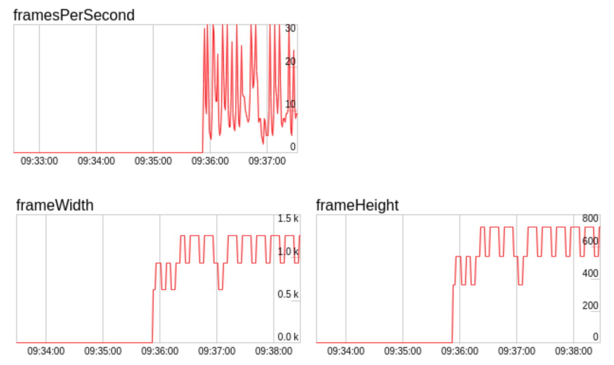

**本文所有源码均基于 WebRTC M85 (branch-heads/4183) 版本进行分析。**

在视频通话过程中，WebRTC 经常会因为糟糕的硬件或网络环境而触发降级（降低帧率或分辨率）。我们可以轻易地从 `PeerConnection::GetStats` 返回的 JSON 中获取到对应的降级原因，这些原因对应到 WebRTC 源码中便是：

```cpp:title=rtcstats_objects.h
struct RTCQualityLimitationReason {
  static const char* const kNone;      // 帧率或分辨率没有受到限制
  static const char* const kCpu;       // 帧率或分辨率主要受到硬件性能的限制
  static const char* const kBandwidth; // 帧率或分辨率主要受到网络带宽的限制
  static const char* const kOther;     // 帧率或分辨率主要受到其他原因的限制
};
```

目前 WebRTC M85 版本并未真正使用 `kOther` 这个字段，因此我们可以简单认为降级无非就是 `kCpu` 或者 `kBandwidth` 这两种原因，即硬件限制或者带宽限制。

## 硬件限制

由 EncodeUsageResource 负责检测编码器是否受到硬件性能的限制，而在它内部又是委托给 OveruseFrameDetector 检测发送端（帧）编码耗时。这其实是一种十分讨巧的方法，因为这样既不需要去读取 CPU 等硬件信息（尤其是跨平台场景）也不需要关心编码器的具体实现（随便用什么编码器）。具体的配置参数如下：

```cpp:title=overuse_frame_detector.h
struct CpuOveruseOptions {
  CpuOveruseOptions();

  // 低于这个阈值，则认为编码器资源足够；
  // 默认值为 (high_encode_... - 1) / 2，如果是硬编则等于 150
  int low_encode_usage_threshold_percent;

  // 高于这个阈值，则认为编码器资源不足；默认值为 85，如果是硬编则等于 200
  int high_encode_usage_threshold_percent;

  // 帧间隔超时，单位为毫秒；默认值为 1500
  int frame_timeout_interval_ms;

  // 开始评估时最少需要多少帧数据；默认值为 120
  int min_frame_samples;

  // 触发降级或者升级至少要评估过几次；默认值为 3
  int min_process_count;

  // 触发降级时需要进过几次连续的评估；默认值为 2
  int high_threshold_consecutive_count;

  // 新的评估方式 SendProcessingUsage2 使用的参数，默认值为 0；
  // 目前仍然使用 SendProcessingUsage1，二者的区别我们暂时不关心
  int filter_time_ms;
};
```

如无必要，上述配置参数的默认值不需要改动。主要还是靠开启硬件编码解决限制。

## 带宽限制

这里我们需要明确的一点是，WebRTC 的编码器码率策略是 CBR（Constant Bitrate），即以恒定码率编码；当视频帧复杂度较高时（比如运动场景），只能通过调节其 QP（Quantization Parameter）值来适应码率。我们可以感性地认为如果 QP 值越大，则视频帧的块效应越明显、质量越差；反之如果 QP 值越小，则视频帧细节越多、质量越好。

WebRTC 的带宽检测模块（比如 GCC）会周期性地评估出当前带宽，并将其设置为编码器的指定码率。编码器会在该码率下尽量编码，直到视频帧的 QP 值超出阈值上限，便会触发降级；如果 QP 值低于阈值下限，则会触发升级。

由 QualityScalerResource 负责检测 QP 值，而在它内部又是委托给 QualityScaler 检测。当然这里并不是简单将当前 QP 值与阈值进行判断，而是需要与历史值平滑处理之后再判断。感兴趣的读者可以阅读 `QualityScaler::QpSmoother` 的源码，笔者就不予赘述了。

## 反馈路径

无论是 EncodeUsageResource 还是 QualityScalerResource 都是通过调用 `VideoStreamEncoderResource::OnResourceUsageStateMeasured` 并传递相应的参数来触发降级或者升级；如果是降级，则传递 `ResourceUsageState::kOveruse` ；如果是升级，则传递 `ResourceUsageState::kUnderuse` 。并最终反馈到采集侧从根源上限制视频帧的输入。

这里以 QualityScalerResource 触发降级的反馈路径为例，给出相应的调用栈：

```
QualityScalerResource::OnReportQpUsageHigh
  → VideoStreamEncoderResource::OnResourceUsageStateMeasured
  → ResourceAdaptationProcessor::ResourceListenerDelegate::OnResourceUsageStateMeasured
  → ResourceAdaptationProcessor::OnResourceUsageStateMeasured
  → ResourceAdaptationProcessor::OnResourceOveruse
  → ResourceAdaptationProcessor::MaybeUpdateVideoSourceRestrictions
  → VideoStreamEncoder::OnVideoSourceRestrictionsUpdated
  → VideoSourceSinkController::PushSourceSinkSettings
  → VideoTrack::AddOrUpdateSink
  → AdaptedVideoTrackSource::AddOrUpdateSink
  → AdaptedVideoTrackSource::OnSinkWantsChanged
  → VideoAdapter::OnSinkWants
```

在 `VideoAdapter::OnSinkWants` 中会更新针对采集到的视频帧的处理参数（比如最大帧率和最大分辨率），这些参数会在 `VideoAdapter::AdaptFrameResolution` 中被使用到；而后者会在 [视频采集流程](https://webrtc.mthli.com/media/video-outbound/#%E9%87%87%E9%9B%86) 中先对视频帧进行参数适配，然后再交付给 VideoBroadcaster，

```java:title=VideoSource.java
public class VideoSource extends MediaSource {
  // other definitions...

  private final CapturerObserver capturerObserver = new CapturerObserver() {
    // other definitions...

    @Override
    public void onFrameCaptured(VideoFrame frame) {
      // 这里 adaptFrame 最终会调用 VideoAdapter::AdaptFrameResolution
      final VideoProcessor.FrameAdaptationParameters parameters =
          // highlight-next-line
          nativeAndroidVideoTrackSource.adaptFrame(frame);
      synchronized (videoProcessorLock) {
        if (videoProcessor != null) {
          videoProcessor.onFrameCaptured(frame, parameters);
          return;
        }
      }

      VideoFrame adaptedFrame = VideoProcessor.applyFrameAdaptationParameters(frame, parameters);
      if (adaptedFrame != null) {
        nativeAndroidVideoTrackSource.onFrameCaptured(adaptedFrame);
        adaptedFrame.release();
      }
    }
  };

  // other definitions...
}
```

综上，降级反馈最终会作用到采集侧从根源上限制视频帧的输入。如果你是按照 WebRTC 默认的 [视频渲染流程](https://webrtc.mthli.com/media/video-outbound/#%E6%B8%B2%E6%9F%93) 添加预览 View 的话，你会看见预览画面也会随着降级反馈变得模糊起来，而解决方案就是直接从摄像头获取帧数据然后自己做渲染。

## 编码前丢帧

曾经我们的 SDK 运行在 iOS 15.4 及其以上版本时，线上反馈视频非常卡顿。通过查看监控，我们发现在带宽稳定的情况下，出现帧率剧烈波动、而分辨率则呈锯齿状上升或者下降的现象，类似的情况可以参见 [FPS fluctuations in stream after updating to iOS 15.4](https://github.com/open-webrtc-toolkit/owt-client-native/issues/589)



经过调研后发现，WebRTC 存在编码前丢帧的逻辑，简单来说就是当输入的视频帧所需的编码码率显著高于带宽评估结果时，WebRTC 就会主动丢弃掉一部分视频帧以满足带宽，这显然是一种背压（Backpressure）处理策略。具体代码如下：

```cpp:title=quality_scaler.cc
QualityScaler::CheckQpResult QualityScaler::CheckQp() const {
  // method body...

  // Check if we should scale down due to high frame drop.
  const absl::optional<int> drop_rate =
      config_.use_all_drop_reasons
          ? framedrop_percent_all_.GetAverageRoundedDown()
          : framedrop_percent_media_opt_.GetAverageRoundedDown();
  // highlight-next-line
  if (drop_rate && *drop_rate >= kFramedropPercentThreshold) {
    RTC_LOG(LS_INFO) << "Reporting high QP, framedrop percent " << *drop_rate;
    return CheckQpResult::kHighQp;
  }

  // method body...
}
```

可以看到，当丢帧率超过 `kFramedropPercentThreshold` 时，就会触发 `CheckQpResult::kHighQp` 并最终触发降级。而如果视频降级后所需的编码码率满足当前带宽了，WebRTC 就会尝试升级以提升视频质量，最终走入了死循环，从而导致上述现象发生。

之所以这个现象只在 iOS 15.4 及其以上版本出现，是因为在相同的编码参数配置下，这些版本的 VideoToolbox 会持续输出码率较高的帧，而解决方案就是将 `RTCVideoEncoderH264.mm` 里定义的 `kLimitToAverageBitRateFactor` 从 1.5 改为 1.1 即可。
