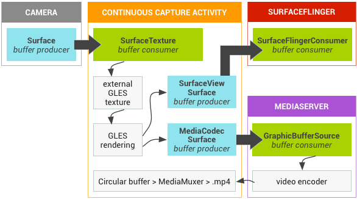

视频的推流大致可以分为采集、渲染、编码和发送四个过程。尽管本书侧重于网络相关的内容，也就是最后的发送过程，但我们依然有必要对整个推流过程有所了解。这也有助于我们给 WebRTC 添加滤镜等功能。

## 采集

采集的实现强烈依赖系统提供的相机 API，但渲染、编码和发送过程与则系统无关。由于笔者是 Android 开发，因此这部分内容将围绕 Android 展开（iOS 应该大同小异）。

当我们需要开启摄像头时，可以调用 WebRTC 提供的 VideoCapturer，这个类（的具体实现）封装并统一了 Android Camera 与 [Camera2](https://developer.android.com/training/camera2) 两套 API 的行为，其初始化方法的定义如下：

```java:title=VideoCapturer.java
public interface VideoCapturer {
  void initialize(
      SurfaceTextureHelper surfaceTextureHelper,
      Context applicationContext,
      CapturerObserver capturerObserver);
  // other definitions...
}
```

SurfaceTextureHelper 是封装了 [SurfaceTexture](https://source.android.com/devices/graphics/arch-st?hl=zh-cn) 的工具类，SurfaceTexture 充当了相机数据的**消费者**。在 Camera2 API 中我们需要调用 `CameraDevice.createCaptureSession(...)` 开启摄像头，此时便需要传入与 SurfaceTexture 关联的 [Surface](https://source.android.com/devices/graphics/arch-sh?hl=zh-cn) 对象：

```java:title=Camera2Session.java
private class CameraStateCallback extends CameraDevice.StateCallback {
  // other definitions...

  @Override
  public void onOpened(CameraDevice camera) {
    // method body...

    surfaceTextureHelper.setTextureSize(captureFormat.width, captureFormat.height);
    // highlight-next-line
    surface = new Surface(surfaceTextureHelper.getSurfaceTexture());
    try {
      camera.createCaptureSession(
          Arrays.asList(surface), new CaptureSessionCallback(), cameraThreadHandler);
    } catch (CameraAccessException e) {
      // method body...
    }
  }

  // other definitions...
}
```

摄像头会将自己捕捉到的数据输出到 Surface，我们可以简单将 Surface 理解为相机数据的**生产者**。这里附上一张来自 [Google Grafika](https://source.android.com/devices/graphics/arch-st?hl=zh-cn#continuous_capture)（一个 Android 多媒体的实验项目）的相机数据的传输路径图，可以很好地帮助我们理解 Surface 与 SurfaceTexture 的关系：



回顾上文，VideoCapturer 初始化时还需要传入 CapturerObserver，其定义如下：

```java:title=CapturerObserver.java
public interface CapturerObserver {
  // other definitions...
  /** Delivers a captured frame. */
  void onFrameCaptured(VideoFrame frame);
}
```

当 SurfaceTexture 的缓冲区 BufferQueue 中有可用的帧数据时，便会回调 `SurfaceTexture.OnFrameAvailableListener` ，并最终回调 `CapturerObserver.onFrameCaptured(frame)` 将帧数据通过 NativeAndroidVideoTrackSource 传递给 WebRTC Native 层：

```java:title=VideoSource.java
public class VideoSource extends MediaSource {
  // other definitions...

  private final CapturerObserver capturerObserver = new CapturerObserver() {
    // other definitions...

    @Override
    public void onFrameCaptured(VideoFrame frame) {
      // body method...

      VideoFrame adaptedFrame = VideoProcessor.applyFrameAdaptationParameters(frame, parameters);
      if (adaptedFrame != null) {
        // highlight-next-line
        nativeAndroidVideoTrackSource.onFrameCaptured(adaptedFrame);
        adaptedFrame.release();
      }
    }
  };

  // other definitions...
}
```

持续追踪 NativeAndroidVideoTrackSource 在 Native 层的调用栈，结果如下：

```
webrtc::jni::AndroidVideoTrackSource::onFrameCaptured
  → rtc::AdaptedVideoTrackSource::OnFrame
  → rtc::VideoBroadcaster::OnFrame
```

摄像头采集的视频帧数据会被传递到 VideoBroadcaster 这个类进行处理，而采集过程也到此为止。从 VideoBroadcaster 的名称就不难发现，帧数据接下来会被以广播的形式发送给各个订阅者，**也就是说后续的渲染、编码（和发送）过程是并行处理的。**

## 渲染

这里的「渲染」指的是预览画面。我们需要调用 `VideoTrack.addSink(sink)` 添加预览画面，`sink` 是实现了 VideoSink 这个接口的类，比如 SurfaceViewRenderer。

```java:title=VideoSink.java
// Java version of rtc::VideoSinkInterface.
public interface VideoSink {
  @CalledByNative void onFrame(VideoFrame frame);
}
```

当我们调用 `VideoTrack.addSink(sink)` 时，实际上是添加了一个 VideoBroadcaster 的订阅者。当有可用的帧数据时，VideoBroadcaster 便会回调 `VideoSink.onFrame(frame)` 。对于 SurfaceViewRenderer 来说，便是将这些帧数据渲染到了 EGL。

## 编码和发送

前面我们说到，只要实现了 VideoSink 并添加到 VideoBroadcaster 即可收到帧数据，编码和发送的过程也是类似的。这里我们直接给出调用栈：

```
webrtc::VideoStreamEncoder::OnFrame
  → webrtc::VideoStreamEncoder::MaybeEncodeVideoFrame
  → webrtc::VideoStreamEncoder::EncodeVideoFrame
  → webrtc::LibvpxVp8Encoder::Encode #1
  → webrtc::LibvpxVp8Encoder::GetEncodedPartitions
  → webrtc::VideoStreamEncoder::OnEncodedImage
  → webrtc::internal::VideoSendStreamImpl::OnEncodedImage
  → webrtc::RtpVideoSender::OnEncodedImage
  → webrtc::RTPSenderVideo::SendEncodedImage
  → webrtc::RTPSenderVideo::SendVideo
  → webrtc::RTPSenderVideo::LogAndSendToNetwork
  → webrtc::RTPSender::EnqueuePackets
  → webrtc::PacedSender::EnqueuePackets
  → webrtc::PacingController::EnqueuePacket
  → webrtc::PacingController::EnqueuePacketInternal
  → webrtc::PacedSender::Process #2
  → webrtc::PacingController::ProcessPackets
  → webrtc::PacedSender::SendRtpPacket
  → webrtc::ModuleRtpRtcpImpl2::TrySendPacket
  → webrtc::RtpSenderEgress::SendPacket
  → webrtc::RtpSenderEgress::SendPacketToNetwork
  → cricket::WebRtcVideoChannel::SendRtp
  → cricket::MediaChannel::SendPacket
  → cricket::MediaChannel::DoSendPacket
  → cricket::VideoChannel::SendPacket
  → webrtc::DtlsSrtpTransport::SendRtpPacket #3
```

这里分别对调用栈中标记的序号做说明：

1. 这里的编码器是 LibvpxVp8Encoder，但换成其他继承自 `webrtc::VideoEncoder` 的子类都是可以的，比如 VP9Encoder 或者 H264Encoder。
2. RtpPacket 入队之后，将由 `webrtc::ProcessThreadImpl::Process` 进行处理，严格意义上已经不算是调用栈了，但读者也可以将其理解为 RtpPacket 的处理流程。
3. 从这里开始进入 PeerConnection 发送数据包的流程。

## 添加滤镜

由于需要实时预览滤镜效果，所以必须在渲染开始之前添加滤镜。好在 WebRTC 已经提供了 VideoProcessor 这个接口类，可以对采集到的帧数据进行预处理，调用 `VideoSource.setVideoProcessor(processor)` 即可设置：

```java:title=VideoSource.java
public class VideoSource extends MediaSource {
  // other definitions...

  private final CapturerObserver capturerObserver = new CapturerObserver() {
    // other definitions...

    @Override
    public void onFrameCaptured(VideoFrame frame) {
      final VideoProcessor.FrameAdaptationParameters parameters =
          nativeAndroidVideoTrackSource.adaptFrame(frame);
      synchronized (videoProcessorLock) {
        if (videoProcessor != null) {
          // highlight-next-line
          videoProcessor.onFrameCaptured(frame, parameters);
          return;
        }
      }

      // body method...
    }
  };

  // other definitions...
}
```

最后给出一个 VideoProcessor 的简单实现，给各位读者参考：

```java
public final class Example implements VideoProcessor {

  @Nullable private VideoSink mVideoSink;

  @Override
  public void onCapturerStarted(boolean success) {
    // DO SOMETHING IF YOU WANT.
  }

  @Override
  public void onCapturerStopped() {
    // DO SOMETHING IF YOU WANT.
  }

  @Override
  public void setSink(@Nullable VideoSink sink) {
    // 需要持有 WebRTC 传入的 VideoSink 对象
    mVideoSink = sink;
  }

  @Override
  public void onFrameCaptured(@NonNull VideoFrame frame) {
    VideoFrame newFrame = yourVideoFilter(frame);

    // 会调用 NativeAndroidVideoTrackSource 将新的帧数据传递给 Native 层
    if (mVideoSink != null) mVideoSink.onFrame(frame);
  }
}
```
